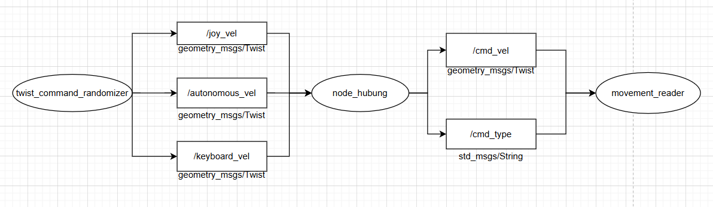

# ms2-tb1-cakrai17-13224065

## 📦 Deskripsi Paket (pkg_13224065)
Paket ini merupakan bagian dari tugas Milestone 2 Tubes Ca-Krai 17. Di dalamnya terdapat sebuah node utama yang mengatur pengiriman kecepatan ke robot berdasarkan berbagai sumber input. Node ini mendukung:

- ✅ **Bridge Mode**: meneruskan kecepatan dari `autonomous_vel` ke `cmd_vel` dan mengirim `"autonomous"` ke `cmd_type`
- ⭐ **Bonus 1 – Mengimplementasikan File Build dan File Config
- ⭐ **Bonus 2 – Multiplexer**: memilih input dari `keyboard_vel`, `joy_vel`, dan `autonomous_vel` berdasarkan prioritas

Node ini ditulis menggunakan Python dan ROS 2 Humble.

## 🧠 Diagram Alur Node

 

## ⚙️ Cara Kerja Node

### File Config (Bonus 1)
Node akan menggunakan nilai parameter yang tertera di file config, yaitu terdapat parameter:
publish_rate: 5.0    # Dalam Satuan Hz
enabled : true       # Aktifkan Node Hubung
log_verbose : true   # Aktifkan Log Verbose untuk Debugging

linear_multipler: 1.0  # Pengali untuk Kecepatan Linear
angular_multipler: 1.0 # Pengali untuk Kecepatan Angular

autonomous_vel_topic: '/autonomous_vel' # Topik untuk Kecepatan Otonom
joy_vel_topic: '/joy_vel'               # Topik untuk Kecepatan Joystick
keyboard_vel_topic: '/keyboard_vel'     # Topik untuk Kecepatan Keyboard

cmd_type_topic: '/cmd_type'             # Topik untuk Tipe Perintah  
cmd_vel_topic: '/cmd_vel'               # Topik untuk Kecepatan Perintah

### 🎮 Multiplexer (Bonus 2)
Node akan memilih satu dari tiga sumber input kecepatan:
1. `keyboard_vel`
2. `joy_vel`
3. `autonomous_vel`

Hanya input dengan prioritas tertinggi yang aktif yang akan diteruskan ke:
- `/cmd_vel` (`geometry_msgs/msg/Twist`)
- `/cmd_type` (`std_msgs/msg/String`), dengan isi `"keyboard"`, `"joystick"`, atau `"autonomous"`

### 🚀 Cara Menjalankan
# 1. Masuk ke workspace dan build
cd ~/ros2_ws
colcon build --packages-select pkg_13224065

# 2. Aktifkan workspace
source install/setup.bash

# 3. Jalankan node 
 ros2 launch pkg_13224065 hubung_node_launch.py

### 📁 Struktur Utama
ms2-tb1-cakrai17-13224065/
├── pkg_13224065              # Package Utama
├── diagram.png               # Diagram alur komunikasi
└── README.md                 # Penjelasan proyek

### 🧑‍💻 Author
Joe Steven Hardy - 13224065
