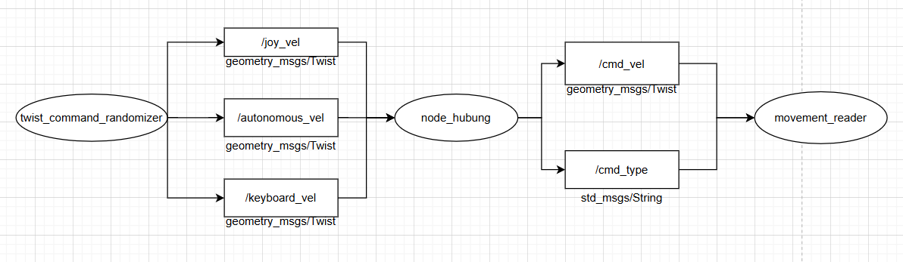

# ms2-tb1-cakrai17-13224065
# pkg_13224065

## 📦 Deskripsi Paket
Paket ini merupakan bagian dari tugas Milestone 2 Tubes Ca-Krai 17. Di dalamnya terdapat sebuah node utama yang mengatur pengiriman kecepatan ke robot berdasarkan berbagai sumber input. Node ini mendukung:

- ✅ **Bridge Mode**: meneruskan kecepatan dari `autonomous_vel` ke `cmd_vel` dan mengirim `"autonomous"` ke `cmd_type`
- ⭐ **Bonus 1 – Mengimplementasikan File Build dan File Config
- ⭐ **Bonus 2 – Multiplexer**: memilih input dari `keyboard_vel`, `joy_vel`, dan `autonomous_vel` berdasarkan prioritas

Node ini ditulis menggunakan Python dan ROS 2 Humble.

## 🧠 Diagram Alur Node

 

## ⚙️ Cara Kerja Node

### 🎮 Multiplexer (Bonus 1)
Node akan memilih satu dari tiga sumber input kecepatan:
1. `keyboard_vel`
2. `joy_vel`
3. `autonomous_vel`

Hanya input dengan prioritas tertinggi yang aktif yang akan diteruskan ke:
- `/cmd_vel` (`geometry_msgs/msg/Twist`)
- `/cmd_type` (`std_msgs/msg/String`), dengan isi `"keyboard"`, `"joystick"`, atau `"autonomous"`

### 🔧 Adjustable Priority (Bonus 2)
Urutan prioritas dapat diatur melalui parameter ROS:
```bash
ros2 param set /velocity_mux priority_order "keyboard,joy,autonomous"

